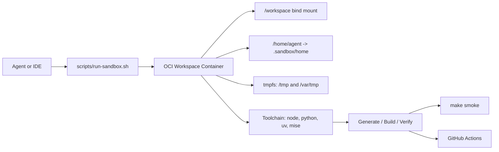

# アーキテクチャ

## レイヤー

- ホスト: コンテナエンジンとワークスペースを保持する
- 安全ラッパー: `scripts/run-sandbox.sh` が実行境界を作る
- ワークスペースコンテナ: 非 root ユーザーで AI エージェントを実行する
- 検証系: `make smoke` と GitHub Actions が別ラインでチェックする
- サンプル系: `examples/` と polyglot smoke で各言語の最小動作を固定する

## 実行フロー

## 役割分担

- `Containerfile`: 最小限の共通ベース
- `bootstrap-languages`: 追加ランタイム導入
- `install-agents`: エージェント CLI 導入
- `run-sandbox`: 権限と mount の安全化
- `polyglot-smoke-test`: 各言語サンプルの実行確認
- `agent-smoke-test`: 各エージェント導線の確認

## 2つの利用モード

- オフライン既定モード: 実装、テスト、レビュー、再現確認
- オンライン明示モード: 依存取得、追加ツール導入、初期セットアップ
